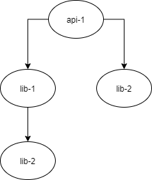

# Calviche

Executes command for all local dependencies respecting the hierarchical dependency order.

## Install

```
npm i calviche
```

## The problem

You have a monorepo like this:

```
api/
-- api-1/
---- package.json
libs/
-- lib-1/
---- package.json
-- lib-2/
---- package.json
```

Where `package.json` from `api-1` declares dependency with `lib-1` and `lib-2` like this:

```json
{
  "name": "api-1",
  "dependencies": {
    "lib-1": "file:../libs/lib-1",
    "lib-2": "file:../libs/lib-2",
    ...
  }
}

```

Similarly `lib-1` declares dependency with `lib-2` like this:

```json
{
  "name": "lib-1",
  "dependencies": {
    "lib-2": "file:../libs/lib-2",
    ...
  }
}

```

Resulting in the following dependency graph:



In this scenario you have the cumbersome task of manually install dependencies from the deepest local dependency up to the root, tracing the graph mentally. Imagine this task in a real enterprise monorepo where you have many more local dependencies. You could use other tools for this task like [lerna](https://github.com/lerna/lerna) or [bolt](https://github.com/boltpkg/bolt#readme) (which are amazing)  but you wouldn't have the flexibility to run command within specific stacks in the monorepo without adding config files in the repo-root.

## Solution

Here is were **Calviche** appears. This library allows to run a command from the deepest local dependency up to the root declaring the command to execute in the root package.

### Example:

Given the previous scenario you just would to declare a custom `install` script like this:


```json
{
  "name": "api-1",
  "scripts": {
    "install": "calviche npm install"
  },
  "dependencies": {
    "lib-1": "file:../libs/lib-1",
    "lib-2": "file:../libs/lib-2",
    ...
  }
}

```

And that's it! **Calviche** will execute the given command in all the local dependencies respecting the dependency graph! You could even execute tests or any command you like in the stack by appending the command after `calviche`, just make sure to install globally the dependency so the binary file can be found.
